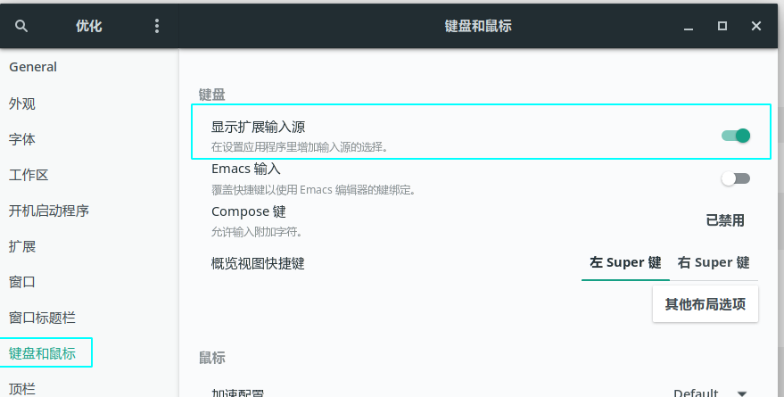

# archlinux安装搜狗拼音输入法
## 安装

```
// $ sudo pacman -S fcitx fcitx-configtool fcitx-sogoupinyin
// 由于依赖fcitx-qt4被从源中移除，sogou拼音尚未相应更新，所以会出现搜狗拼音无法使用的情况，所以暂时用下面的方式替代
$ sudo pacman -S fcitx-lilydjwg-git fcitx-configtool fcitx-sogoupinyin
```

## 配置

安装完之后我们还不可以直接使用，还需要进行一定的配置，用文本编辑器打开~/.xprofile，没有就新建，在其末尾添加以下几行：

```
export GTK_IM_MODULE=fcitx
export QT_IM_MODULE=fcitx
export XMODIFIERS="@im=fcitx"
```

然后注销后重新登录，或者重启后重新登录。

### 可能的问题

如果遇到登录之后输入法fcitx没有启动的问题，可以讲fcitx设置为自动启动，deepin桌面下右键fcitx的图片就能做到，gnome桌面可以用gnome-tweaks，也可以就简单的在.xprofile里面加一句fcitx。

