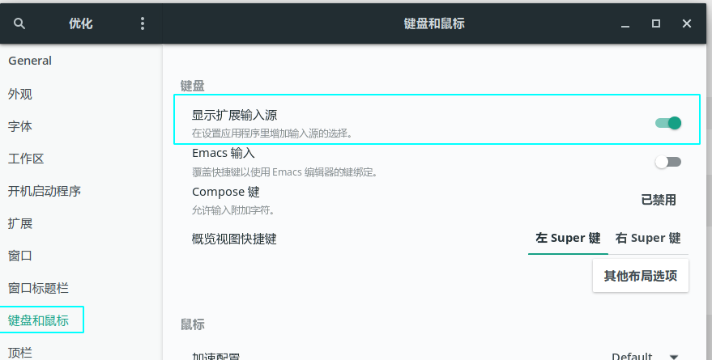

# archlinux安装搜狗拼音输入法
## 安装

### 安装Fcitx

由于搜狗拼音输入法依赖于Fcitx，在安装搜狗拼音输入法之前，需要先行安装Fcitx，在终端窗口下直接输入：

```
$ sudo pacman -S fcitx
```

即可完成安装，需要注意的是，仅仅安装这一项是不够的，这样在安装完成之后，Fcitx基本上是处于不可用的状态，我们还需要安装以下几个包：

```
$ sudo pacman -S fcitx-configtool
$ sudo pacman -S fcitx-gtk2 fcitx-gtk3 fcitx-qt4 fcitx-qt5
```

### 安装搜狗拼音

在前一步中我们已经正确的配置了源，这里直接输入：

```
$ sudo pacman -S fcitx-sogoupinyin
// 安装配置工具
$ sudo pacman -S fcitx-configtool
```

## 配置

安装完之后我们还不可以直接使用，还需要进行一定的配置，用文本编辑器打开~/.xprofile，没有就新建，在其末尾添加以下几行：

```
export GTK_IM_MODULE=fcitx
export QT_IM_MODULE=fcitx
export XMODIFIERS="@im=fcitx"
```

然后注销后重新登录，或者重启后重新登录。

### 可能的问题

如果遇到登录之后输入法fcitx没有启动的问题，可以讲fcitx设置为自动启动，deepin桌面下右键fcitx的图片就能做到，gnome桌面可以用gnome-tweaks，也可以就简单的在.xprofile里面加一句fcitx。
