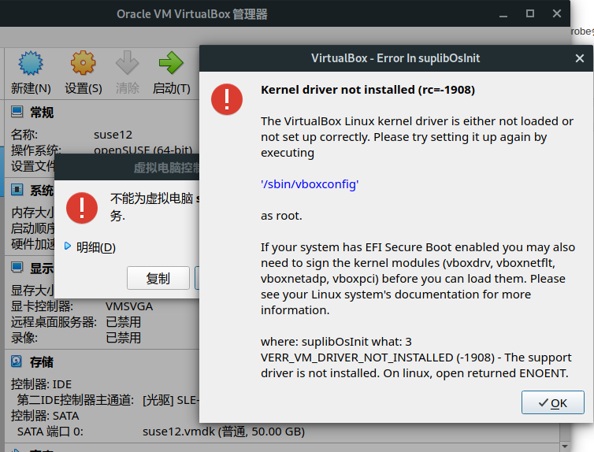
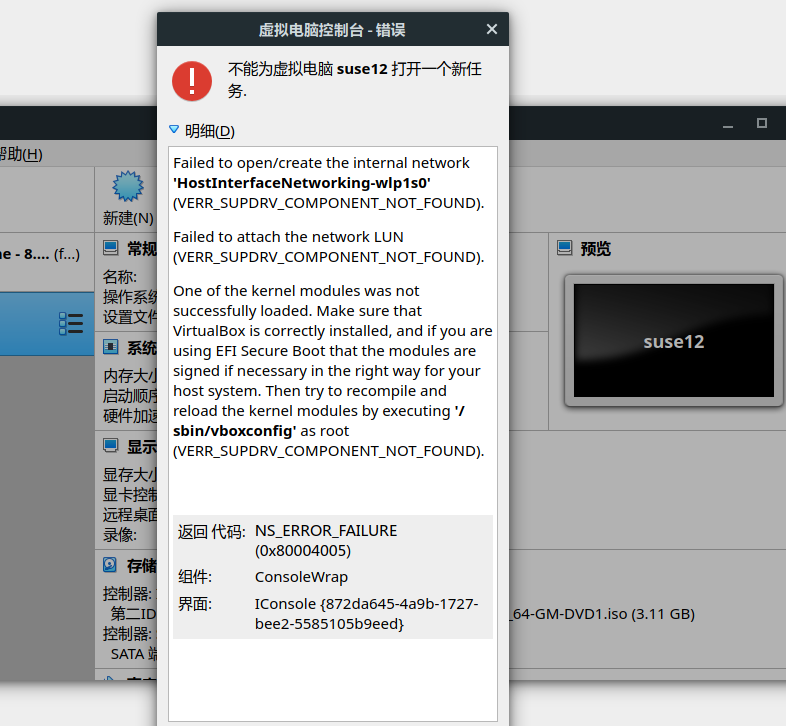

# virtualbox驱动加载异常处理
## 1. Kernel driver not installed (rc=-1908)


### 解决办法：
执行下面的命令，加载vboxdrv
```
$ sudo modprobe vboxdrv
```
## 2. Failed to open/create the internal network

### 解决办法：
执行下面的命令，加载网络模块
```
$ sudo modprobe vboxnetflt
```
